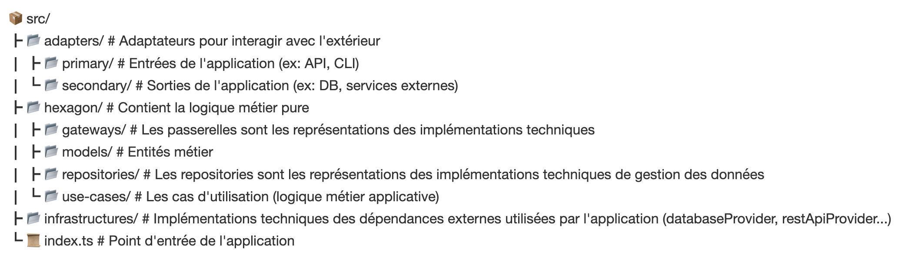

# Installation 
- Créer un fichier .env reprenant les clés du fichier .env.example
- npm i --legacy-peer-deps
- npx tsc
- npm start

# Algorithmes et design patterns utilisés
Pour l'architecture principale de l'API, j'ai choisi d'utiliser une architecture hexagonale suivant les principes de la Clean Architecture : 
- Indépendance : Pas de dépendance forte à un framework spécifique, une librairie, une base de données...
- Testabilité : Le cœur métier doit pouvoir être testé facilement.

## Structure des dossiers

J'ai bien conscience que pour un projet comme celui-ci, ce choix de design pattern est overkill, mais dans le cadre d'un projet visant à tester mes compétences, c'est ce qui me permet de restituer au mieux l'expérience que j'ai acquise. C'est également un design pattern sur lequel j'aime particulièrement travailler grâce à son découpage logique qui s'adapte naturellement avec une approche TDD en plus d'offrir une sécurité dans l'utilisation des librairies JS qui évoluent et changent souvent.

# Choix techniques
## Typescript
J'ai choisi d'utiliser TypeScript car, grâce à ses typages (s'ils sont bien faits), TS améliore la propreté et la fiabilité du code. Il facilite la maintenance et aide à détecter les erreurs en amont au moment de la compilation (gain de temps). 

## Zod
Zod est la librairie de validation de schéma ayant la plus forte intégration avec TS que je connaisse et est très largement utilisée.

## Express
Express pour la gestion des requêtes HTTP. Je l'ai principalement choisi en fonction de mes connaissances personnelles ainsi que pour sa forte popularité, ce qui offre une garantie sur la documentation et les éventuels problèmes que je suis amené à rencontrer.

## Les classes TS
J'ai choisi de favoriser l'utilisation de classes pour une meilleure organisation du code et parce qu'elles sont plus modulaires et faciles à maintenir. Notamment grâce à l'héritage et aux instances, ce qui me permet d'injecter les dépendances.

## ESLint
ESLint me permet d'appliquer les bonnes pratiques et de standardiser le style de code. Il est également pour moi un gain de temps car il permet de formater automatiquement le code à la sauvegarde du fichier.

# Améliorations
- Récupérer l'IP et mettre en place un rate limit
- Mettre en cache la météo afin de limiter les appels à OpenWeather
- Créer des règles de validation custom Zod réutilisables
- Mettre en place un Swagger pour documenter l'API
- Implémenter les décorateurs pour simplifier la déclaration des routes et auto-générer la documentation Swagger
- Implémenter un provider de validation pour garder la même structure en cas d'erreur
- Personnaliser davantage les erreurs renvoyées par OpenWeather. Par exemple si la clé API est incorrecte, il ne pas envoyer le détail au client mais plutot générer une erreur 500.
- Retourner le même schéma de réponse entre lat/lng et city
- Système de log (journal des appels)
- Envoyer un message Slack lors des erreurs serveur
- Tests de charge avec JMeter ou Gatling
